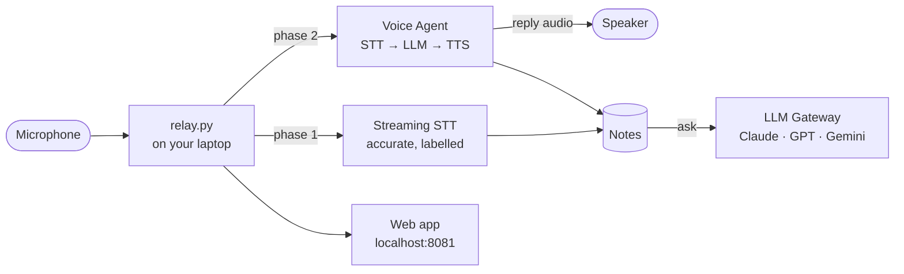

# Workshop: a voice you can talk to, that also takes notes you can ask about

Three phases. Each one works on its own, and each builds on the last.

| Phase | You build | AssemblyAI API | Time |
|---|---|---|---|
| [1 · Notetaker](phase-1-notetaker.md) | Live, speaker-labelled notes you can ask questions of | Streaming STT + LLM Gateway | ~40 min |
| [2 · Voice agent](phase-2-voice-agent.md) | A character you can talk to | Voice Agent | ~30 min |
| [3 · Both at once](phase-3-agent-and-notes.md) | Talk to it *and* keep accurate notes | Both, in parallel | ~45 min |

Every phase ends in the same web app — the dashboard at `http://localhost:8081` —
so you can see what you built, not just read terminal output.



## No hardware required

All three phases run on **just a laptop**, using its own microphone and speakers.
The ESP32 phone in this repo is optional: it is one more microphone and speaker
on the network, and nothing in the AI side changes when you add it.

Use **headphones** for phases 2 and 3. Otherwise the laptop mic hears the agent's
voice and it starts replying to itself — phase 2 explains why, and how the code
deals with it when you can't.

## Setup (once)

```bash
git clone https://github.com/hsingh-aai/Hardware-VoiceAgent-Night
cd Hardware-VoiceAgent-Night

python3 -m venv ~/esp-tools
~/esp-tools/bin/pip install websockets sounddevice numpy

echo "ASSEMBLYAI_API_KEY=your-key-here" > relay/.env
```

`relay/.env` is gitignored. Never paste the key into code you commit.

On first run macOS asks for **microphone permission** for your terminal — allow it.

## Running the full app

```bash
./phone
```

Then open **http://localhost:8081**. With no phone attached, press
**Start a call (no phone)** to use your laptop instead.

## Why these three, in this order

Transcription is the simplest thing to get right, so it comes first. Conversation
adds a model, a voice and turn-taking. Running both at once looks like a small
step and isn't — it's where the interesting engineering lives: two streams with
different jobs, one microphone, and an echo problem that affects both.

Each phase lists the **gotchas we actually hit**, with the error you'll see. Most
of them are not in the quickstart docs.
