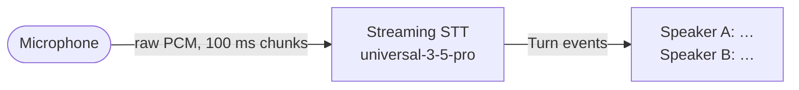

# Phase 1 · Notetaker

**Goal:** turn speech into readable notes, live, with each speaker labelled.



No conversation yet — nothing talks back. This is the whole of a notetaker:
capture audio, stream it, keep the finished turns.

## Build it — the whole thing is ~40 lines

Save as `phase1_notes.py` next to `relay/`. This exact code was run against the
live API with two different voices and labelled them correctly.

```python
# phase1_notes.py - a live notetaker: Mac mic -> AssemblyAI Streaming -> terminal
import asyncio, json, os, queue
from urllib.parse import urlencode
import sounddevice as sd
import websockets

KEY  = os.environ["ASSEMBLYAI_API_KEY"]
RATE = 24000
CHUNK = RATE // 10          # 100 ms per message - the API rejects anything under 50 ms
PARAMS = {
    "sample_rate": RATE, "encoding": "pcm_s16le",
    "speech_model": "universal-3-5-pro",
    "format_turns": "true",          # punctuation + casing
    "speaker_labels": "true",        # who said it
    "mode": "max_accuracy",          # notes want accuracy over speed
}
URL = "wss://streaming.assemblyai.com/v3/ws?" + urlencode(PARAMS)

async def main():
    mic = queue.Queue()
    stream = sd.InputStream(samplerate=RATE, channels=1, dtype="int16",
                            blocksize=CHUNK, callback=lambda d, *_: mic.put(bytes(d)))
    # Streaming takes the raw key - no "Bearer " prefix (the Voice Agent wants one)
    async with websockets.connect(URL, additional_headers={"Authorization": KEY}) as ws:
        loop = asyncio.get_running_loop()

        async def send():
            while True:
                await ws.send(await loop.run_in_executor(None, mic.get))

        async def receive():
            async for raw in ws:
                m = json.loads(raw)
                if m["type"] == "Turn" and m.get("end_of_turn") and m.get("turn_is_formatted"):
                    # the field is speaker_label, not speaker
                    print(f"Speaker {m.get('speaker_label', '?')}: {m['transcript']}", flush=True)
                elif m["type"] == "Error":
                    print("error:", m.get("error"))

        with stream:
            await asyncio.gather(send(), receive())

asyncio.run(main())
```

```bash
export ASSEMBLYAI_API_KEY=$(grep ASSEMBLYAI_API_KEY relay/.env | cut -d= -f2)
~/esp-tools/bin/python phase1_notes.py
```

Talk. Get a second person to talk. You should see:

```
Speaker A: Remind me to buy milk and call Grandma on Sunday afternoon.
Speaker B: Also, the dentist appointment moved to Thursday at 3.
```

## See it in the web app

```bash
./phone
```

Open http://localhost:8081, set **Mode → Notes only**, press **Start a call (no
phone)**, then open the **Notes** tab. Same stream, rendered with timestamps and
colour-coded speakers, and **Copy** / **Download .md** buttons.

> In the full app the voice agent is still connected in notes-only mode — just
> deaf and silent. The standalone script above is the pure version.

## The contract (verified against the live API)

| | |
|---|---|
| URL | `wss://streaming.assemblyai.com/v3/ws?<params>` |
| Auth header | `Authorization: <key>` — **no** `Bearer` |
| Send | raw binary PCM frames, **50–1000 ms each** |
| Finish | `{"type": "Terminate"}` so the last turn is finalised |
| Receive | `Begin` → `SpeechStarted` → `Turn` … → `Termination` |
| A finished turn | `Turn` with `end_of_turn` **and** `turn_is_formatted` true |
| Speaker | `speaker_label` (`"A"`, `"B"`…) and `speaker_confidence` |
| Sample rate | 24 kHz works; so does 16 kHz |

## Gotchas we hit

**`3007 Input Duration Violation: 13.3 ms. Expected between 50 and 1000 ms`.**
Every audio message must be 50–1000 ms. Small frames are normal for devices — the
ESP32 in this repo sends 13 ms frames — so buffer them into ~100 ms before sending.
The socket closes on the first bad chunk, and it keeps happening if you reconnect.

**Speaker labels silently never appear.** The field is `speaker_label`. Reading
`speaker` returns `None` every time, with no error — our older notetaker shipped
with exactly this bug.

**`keyterms_prompt` is one parameter holding a JSON array.** Repeating it once per
term returns `3006 Invalid JSON array` and closes the socket.

**Partials look like duplicates.** You get many `Turn` messages per utterance as
the text firms up. Only keep the one where both `end_of_turn` and
`turn_is_formatted` are true.

## Try this

1. Add `"keyterms_prompt": json.dumps(["Pip", "Grandma"])` and see names recognised.
2. Swap `max_accuracy` for `balanced` and compare the notes side by side.
3. Write each finished turn to `notes.md` as it arrives.
4. Stop cleanly on Ctrl-C by sending `{"type": "Terminate"}` first.

**Next:** [Phase 2 · Voice agent](phase-2-voice-agent.md)
