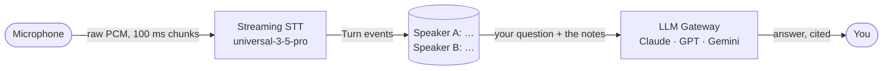

# Phase 1 · Notetaker

**Goal:** turn speech into readable notes, live, with each speaker labelled — and
then ask those notes questions, like Granola.



Nothing talks back yet. Two parts: **1a** captures and labels the notes, **1b**
asks questions of them.

## 1a · Take the notes

Save as `phase1_notes.py` next to `relay/`. This exact code was run against the
live API with two different voices and labelled them correctly.

```python
# phase1_notes.py - a live notetaker: Mac mic -> AssemblyAI Streaming -> terminal
import asyncio, json, os, queue
from urllib.parse import urlencode
import sounddevice as sd
import websockets

KEY  = os.environ["ASSEMBLYAI_API_KEY"]
RATE = 24000
CHUNK = RATE // 10          # 100 ms per message - the API rejects anything under 50 ms
PARAMS = {
    "sample_rate": RATE, "encoding": "pcm_s16le",
    "speech_model": "universal-3-5-pro",
    "format_turns": "true",          # punctuation + casing
    "speaker_labels": "true",        # who said it
    "mode": "max_accuracy",          # notes want accuracy over speed
}
URL = "wss://streaming.assemblyai.com/v3/ws?" + urlencode(PARAMS)

async def main():
    mic = queue.Queue()
    stream = sd.InputStream(samplerate=RATE, channels=1, dtype="int16",
                            blocksize=CHUNK, callback=lambda d, *_: mic.put(bytes(d)))
    # Streaming takes the raw key - no "Bearer " prefix (the Voice Agent wants one)
    async with websockets.connect(URL, additional_headers={"Authorization": KEY}) as ws:
        loop = asyncio.get_running_loop()

        async def send():
            while True:
                await ws.send(await loop.run_in_executor(None, mic.get))

        async def receive():
            async for raw in ws:
                m = json.loads(raw)
                if m["type"] == "Turn" and m.get("end_of_turn") and m.get("turn_is_formatted"):
                    # the field is speaker_label, not speaker
                    line = f"Speaker {m.get('speaker_label', '?')}: {m['transcript']}"
                    print(line, flush=True)
                    with open("notes.txt", "a") as f:   # keep them - phase 1b asks questions of this
                        f.write(line + "\n")
                elif m["type"] == "Error":
                    print("error:", m.get("error"))

        with stream:
            await asyncio.gather(send(), receive())

asyncio.run(main())
```

```bash
export ASSEMBLYAI_API_KEY=$(grep ASSEMBLYAI_API_KEY relay/.env | cut -d= -f2)
~/esp-tools/bin/python phase1_notes.py
```

Talk. Get a second person to talk. Each finished turn prints, and is appended to
`notes.txt`:

```
Speaker A: Remind me to buy milk and call Grandma on Sunday afternoon.
Speaker B: Also, the dentist appointment moved to Thursday at 3.
```

## 1b · Ask your notes

LLM Gateway is one OpenAI-compatible endpoint in front of Claude, GPT, Gemini and
more — change the `model` string to change who answers. Save as `ask_notes.py`:

```python
# ask_notes.py - ask questions about notes.txt, using any model on LLM Gateway
import json, os, sys, urllib.request

KEY   = os.environ["ASSEMBLYAI_API_KEY"]
MODEL = "claude-haiku-4-5-20251001"          # any id from GET /v1/models
URL   = "https://llm-gateway.assemblyai.com/v1/chat/completions"

notes    = open("notes.txt").read()
question = " ".join(sys.argv[1:]) or "What are the reminders and action items?"

body = {"model": MODEL, "max_tokens": 500, "messages": [
    {"role": "system", "content": "Answer ONLY from these notes. If they don't "
                                  "contain the answer, say so.\n\nNOTES:\n" + notes},
    {"role": "user", "content": question},
]}
req = urllib.request.Request(URL, data=json.dumps(body).encode(),
                             headers={"authorization": KEY, "content-type": "application/json"})
with urllib.request.urlopen(req) as r:
    print(json.load(r)["choices"][0]["message"]["content"])
```

```bash
~/esp-tools/bin/python ask_notes.py "What are the reminders?"
~/esp-tools/bin/python ask_notes.py "What colour is my car?"
```

Against the notes above, that gives:

```
From Speaker A:
- Buy milk
- Call Grandma on Sunday afternoon
From Speaker B:
- Dentist appointment on Thursday at 3

I don't have that information in the notes provided.
```

The second answer matters as much as the first. "Answer ONLY from these notes"
is what stops it inventing a car.

## See it in the web app

```bash
./phone
```

Open http://localhost:8081, set **Mode → Notes only**, press **Start a call (no
phone)**, and talk.

- **Notes** tab — the same stream with timestamps, colour-coded speakers, and
  **Copy** / **Download .md**.
- **Chat** tab — ask questions in plain language. Answers stream in, cite when
  each thing was said (`Sep 29 14:47`), keep track of follow-ups, and a picker
  switches between all the models the gateway offers.

> In the full app the voice agent is still connected in notes-only mode — just
> deaf and silent. The two scripts above are the pure version.

## The contracts (verified against the live API)

**Streaming STT**

| | |
|---|---|
| URL | `wss://streaming.assemblyai.com/v3/ws?<params>` |
| Auth header | `Authorization: <key>` — **no** `Bearer` |
| Send | raw binary PCM frames, **50–1000 ms each** |
| Finish | `{"type": "Terminate"}` so the last turn is finalised |
| Receive | `Begin` → `SpeechStarted` → `Turn` … → `Termination` |
| A finished turn | `Turn` with `end_of_turn` **and** `turn_is_formatted` true |
| Speaker | `speaker_label` (`"A"`, `"B"`…) and `speaker_confidence` |
| Sample rate | 24 kHz works; so does 16 kHz |

**LLM Gateway**

| | |
|---|---|
| URL | `POST https://llm-gateway.assemblyai.com/v1/chat/completions` |
| Auth header | raw key **or** `Bearer <key>` — both work |
| Body | OpenAI chat format: `model`, `messages`, `max_tokens` |
| Models | `GET /v1/models` — 47 on the day we checked |
| Streaming | `"stream": true` → `data: {...}` lines, ending `data: [DONE]` |

## Gotchas we hit

**`3007 Input Duration Violation: 13.3 ms. Expected between 50 and 1000 ms`.**
Every audio message must be 50–1000 ms. Small frames are normal for devices — the
ESP32 in this repo sends 13 ms frames — so buffer them into ~100 ms before sending.
The socket closes on the first bad chunk, and it keeps happening if you reconnect.

**Speaker labels silently never appear.** The field is `speaker_label`. Reading
`speaker` returns `None` every time, with no error — our older notetaker shipped
with exactly this bug.

**The quickstart's example model doesn't exist.** `qwen3.5-4b-fast` returns
`400 model qwen3.5-4b-fast is not supported`. Pick a model from `GET /v1/models`
instead of copying it — the web app fills its picker from that list for exactly
this reason.

**`keyterms_prompt` is one parameter holding a JSON array.** Repeating it once per
term returns `3006 Invalid JSON array` and closes the socket.

**Partials look like duplicates.** You get many `Turn` messages per utterance as
the text firms up. Only keep the one where both `end_of_turn` and
`turn_is_formatted` are true.

**Model answers are markdown — escape before you render.** The notes and the reply
are both text you don't control. In a web page, escape everything first, then add
back only the few tags you support; otherwise a spoken or generated `` becomes live code.

**Asking a question sends the notes off your machine.** The gateway routes them to
whichever provider serves the model you picked.

## Try this

1. Add `"keyterms_prompt": json.dumps(["Pip", "Grandma"])` and see names recognised.
2. Swap `max_accuracy` for `balanced` and compare the notes side by side.
3. Ask the same question with `gpt-5-mini` and `gemini-3.5-flash` — does the answer change?
4. Make `ask_notes.py` a loop, sending the previous turns along so follow-ups work.
5. Add `"stream": true` and print the answer as it arrives.

**Next:** [Phase 2 · Voice agent](phase-2-voice-agent.md)
