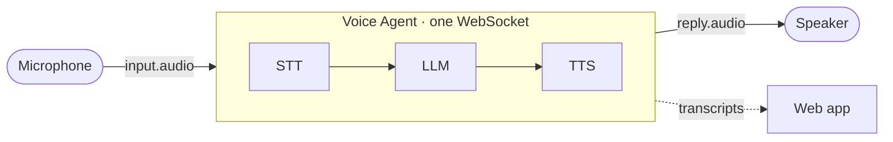

# Phase 2 · Voice agent

**Goal:** a character you can talk to — it listens, thinks and answers out loud.



One connection does the whole pipeline. You send audio in and get audio back,
plus transcripts of both sides along the way.

## Run it

**Wear headphones.** Then:

```bash
~/esp-tools/bin/python relay/voice_agent.py
```

It greets you and answers. Change its personality in the `SESSION` block at the
top of [`relay/voice_agent.py`](../relay/voice_agent.py) — `system_prompt`,
`greeting`, `voice` — and restart.

## See it in the web app

```bash
./phone
```

Open http://localhost:8081, leave **Mode → Talk + notes**, press **Start a call
(no phone)**. The **Live** tab shows the conversation as it happens. Try
*"Furby, turn it up"* — the agent changes its own volume (see Tools below).

## The contract (verified against the live API)

| | |
|---|---|
| URL | `wss://agents.assemblyai.com/v1/ws` |
| Auth header | `Authorization: Bearer <key>` — **with** `Bearer` (Streaming has none) |
| First message | `{"type": "session.update", "session": {...}}` |
| Send audio | `{"type": "input.audio", "audio": "<base64 PCM>"}` |
| Receive audio | `{"type": "reply.audio", "data": "<base64 PCM>"}` |
| Audio format | 16-bit mono PCM at **24 kHz** |
| Transcripts | `transcript.user.*`, `transcript.agent.delta`, `transcript.agent` |
| Tool call in | `tool.call` with `call_id`, `name`, `arguments` |
| Tool result out | `tool.result` with `call_id` and `result` — a **JSON string** |

## Gotchas we hit

**The personality is silently ignored.** Config goes under `"session"` on the way
in, but the server echoes it back under `"config"`. Send it as `"config"` and
`session.updated` arrives with `system_prompt: ""` and no error.

**The session connects, reports healthy, and plays silence forever.** Inbound
audio is in a field called `audio`; outbound is in `data`. Read `m["audio"]` off
`reply.audio` and you get nothing, with no error.

**Use 24 kHz.** Other rates were accepted at setup but failed later in our testing.

**The voice can't change mid-call.** It's fixed once the session connects —
change it and reconnect. English voices: `alba` `eve` `george` `jane` `jean`
`mary` `michael` (US), `anna` `charles` `paul` `vera` (UK).

**`tool.result` must be a string.** Send `"result": json.dumps({...})`, not a
nested object.

## Echo: why it talks to itself

Without headphones, the mic hears the agent's own voice, transcribes it as you,
and replies to it — an endless loop of *"Sorry, I didn't catch that."*

Your laptop avoids this in video calls with **acoustic echo cancellation**: it
knows what it sent to the speaker and subtracts that from the mic. That needs mic
and speaker on one clock with a fixed, tiny delay. Here the reply crosses the
network twice with a jitter buffer between, so the delay is 200–500 ms and drifts.

So the relay uses a **half-duplex gate** instead: the mic is ignored while the
agent is speaking. The trap is *when to reopen it* — reply audio arrives faster
than real time, so `reply.done` comes well before the speaker falls silent. The
gate is timed by the duration of audio queued, not by the message:

```python
speak_until = max(speak_until, time.monotonic()) + len(pcm) / 2 / RATE
```

The cost: you can't interrupt the agent mid-sentence. Hardware with built-in echo
cancellation removes that trade-off.

## Tools: letting it act

The agent can call functions you define. This one turns its own volume up
(verified by voice: *"Furby, turn it up"* → `adjust_volume(direction="up")`):

```python
{"type": "function", "name": "adjust_volume",
 "description": "Make the speaker louder or quieter by one step. Use for "
                "'turn it up', 'too loud', 'I can't hear you'.",
 "parameters": {"type": "object",
                "properties": {"direction": {"type": "string", "enum": ["up", "down"]}},
                "required": ["direction"]}}
```

The description is what the model reads to decide *when* to call it — write it
around what people actually say. See `TOOLS` in [`relay.py`](../relay/relay.py)
and `run_tool` for how calls are answered.

## Try this

1. Give it a new personality and a voice from the list above.
2. Add a `tell_time` tool that returns the current time.
3. Make the greeting ask for the caller's name, and have it use it.
4. Take the headphones off and watch the echo loop happen — then put them back.

**Next:** [Phase 3 · Both at once](phase-3-agent-and-notes.md)
