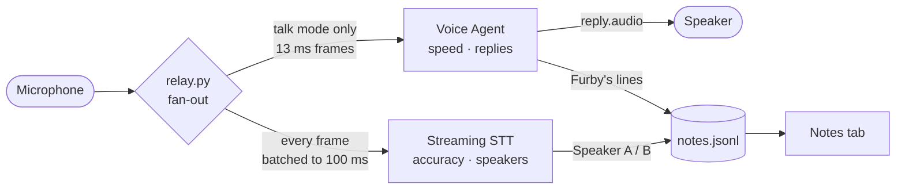

# Phase 3 · Both at once

**Goal:** talk to the agent *and* keep an accurate, speaker-labelled record — and
switch it into a listen-only notetaker by voice.



## Why run two streams?

The agent's speech recognition is tuned for **speed** — it has to answer quickly.
The Streaming API can be tuned for **accuracy** and labels speakers. In our test,
the same sentence went to both:

| | Heard |
|---|---|
| Notetaker | *"Also, the dentist appointment moved to Thursday at 3."* |
| Agent | replied *"I am sorry, I did not quite catch that."* |

The agent is for the conversation. The notetaker is for the record.

## Run it

```bash
./phone
```

Open http://localhost:8081, press **Start a call (no phone)**, and talk. Watch
**Live** (the conversation) and **Notes** (the record) fill at the same time.

Then say *"Furby, just listen for a bit."* Furby says goodbye and goes quiet, but
Notes keeps writing. Say *"Hey Furby"* and it comes back. The **Mode** switch does
the same from the dashboard.

## How it works

All of this is in [`relay/relay.py`](../relay/relay.py).

**1. Fan-out.** Each microphone frame goes to the notetaker always, and to the
agent only in talk mode. While the agent is speaking, the echo gate replaces
frames with **silence** for the notetaker, never nothing:

```python
if gated:                         # Furby is talking: don't let either stream hear it
    to_notes(bytes(len(frame)))   # ...but the notetaker must still hear time pass
    continue
to_notes(frame)                   # the notetaker always hears
if runtime["mode"] != "talk":
    continue                      # Furby only hears in talk mode
await agent.send(...)
```

The notetaker closes a sentence by *hearing silence* after it. Drop the gated
frames instead and, if Furby starts answering quickly, the sentence before it is
never closed — the agent hears and answers it, but it never reaches your notes.

**2. The notetaker** (`notes_stream`) is a second connection with its own job. It
batches frames to 100 ms, and it contains its own failures: if it drops, it
reconnects — it must never end the call.

**3. Furby's side of the notes** comes from the agent's own clean transcript, not
from re-transcribing the speaker. So the record reads *Speaker A*, *Speaker B*,
*Furby*, and nobody is transcribed twice.

**4. Modes** (`set_mode`). *Talk + notes* is the default. *Notes only* silences
Furby and discards any reply already in flight. Furby can switch itself with the
`start_listening` tool — and since it's deaf in that mode, the **notetaker**
listens for its name to switch back (`WAKE`).

**5. Lifecycle.** The notetaker runs as its own task, cancelled on hang-up, and
sends `Terminate` so the last turn is finalised rather than dropped.

## Gotchas we hit

**A billed stream that outlives the call.** The call loop uses `asyncio.gather`,
which does **not** cancel sibling tasks when one fails. Put the notetaker inside it
and a dead call leaves it reconnecting forever — one extra stream per call. So it
gets its own task, cancelled explicitly:

```python
notes_task = asyncio.create_task(notes_stream())
try:
    await asyncio.gather(esp_to_agent(), mac_to_agent(), agent_to_out())
finally:
    notes_task.cancel()
```

**Same frames, different rules.** The agent happily takes 13 ms frames; the
Streaming API closes the socket on them (`3007`). The fan-out forwards frames
as-is to the agent and batches them for the notetaker.

**It answers after you told it to be quiet.** A reply already being generated
finishes playing after the switch. Switching to notes mode now flushes queued
audio and drops the rest of that reply.

**The goodbye gets cut off.** When Furby switches *itself* via the tool, switching
immediately would discard the very reply that says goodbye. The tool sets a
pending switch that applies on the next `reply.done` (with an 8-second fallback).

**Half-duplex hurts the notes too.** While Furby talks, the mic is gated — so
anything you say over Furby is lost from *both* streams. That's the echo trade-off
from phase 2, now costing you notes. Hardware echo cancellation fixes both.

**The wake word has to be an address, not a mention.** The first name, "Pip", came
back as "Phil". "Furby" survives transcription better, but it also turns up in
conversation — at a Furby workshop, constantly — and a passing *"a Furby that
someone bought"* woke it. So `WAKE` only fires on **"Hey / OK / Hi Furby"**, or on
**"Furby,"** opening a turn. The notetaker's formatter adds that comma for a
direct address (*"Furby, wake up"*) but not for a mention (*"Furby workshop starts
at six"*). The Mode switch is still the sure way back.

**New message types appeared as chat bubbles.** The web app's message handler ended
in a catch-all that rendered anything unknown into the conversation. New types
(`note_turn`, `note_partial`, `mode`) need their own branch *before* it.

## Privacy

Notes hold real speech — in this project, a child's. So `relay/notes.jsonl` is
gitignored, and the web server serves only an explicit allowlist of files
(`ALLOWED`), because the same directory holds `.env` and the server listens on
your network.

Running both streams also means **two billed streams** during talk mode.

## Try this

1. Let people rename *Speaker A* to a real name in the Notes tab.
2. When a call ends, send the notes to an LLM for a summary and action items.
3. Add a search box to the Notes tab.
4. Make *Notes only* the default for a "meeting mode".

**Back to:** [Workshop overview](README.md)
